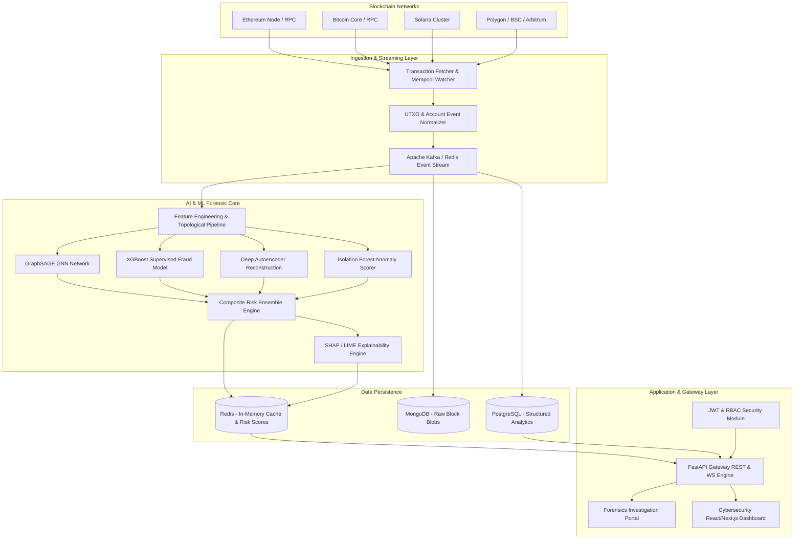
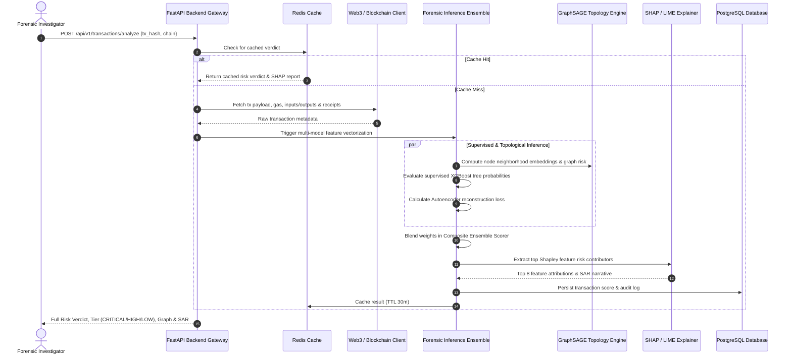
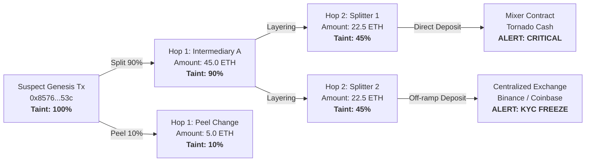
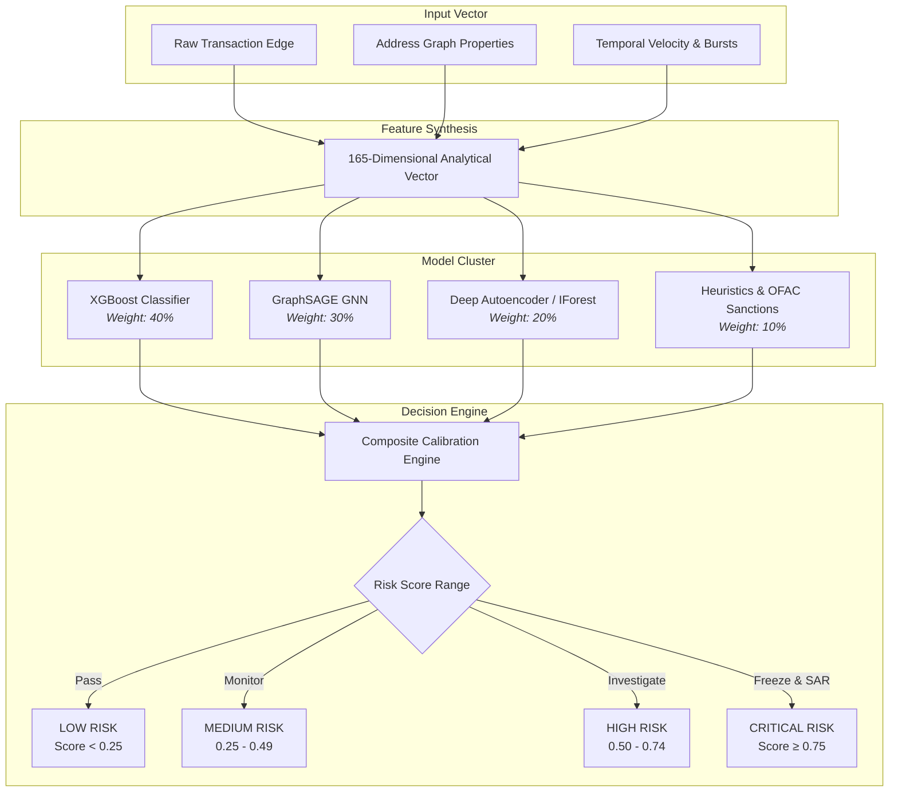

# Crypto-Trace-AI: AI-Powered Blockchain Forensic & Fraud Detection Platform

<div align="center">

<!-- Dual Theme Responsive Logos -->
<picture>
  <source media="(prefers-color-scheme: dark)" srcset="public/logo/light-horizontal-logo.svg">
  <source media="(prefers-color-scheme: light)" srcset="public/logo/dark-horizontal-logo.svg">
  
</picture>

<br/><br/>

[](https://github.com/rajdeepcodeshere247/Crypto-Trace-AI)
[](https://www.python.org/)
[](https://fastapi.tiangolo.com/)
[](https://pytorch.org/)
[](https://xgboost.readthedocs.io/)
[](LICENSE)

<br/>

[](CryptoTrace-AI.pptx)
[](CryptoTrace-AI.pdf)

<br/>

**An enterprise-grade, multi-chain blockchain forensics, fraud detection, and multi-hop transaction tracing platform powered by Graph Neural Networks (GNN), Gradient Boosted Trees, Unsupervised Anomaly Detectors, and Explainable AI (SHAP & LIME).**

<br/>

> 📌 **Key Project Resources:**
> - 📊 **Presentation Deck:** [`CryptoTrace-AI.pptx`](CryptoTrace-AI.pptx)
> - 📄 **Comprehensive Whitepaper & Report:** [`CryptoTrace-AI.pdf`](CryptoTrace-AI.pdf)

</div>

---

## Table of Contents

1. [Executive Summary](#executive-summary)
2. [System Architecture & Design](#system-architecture--design)
   - [High-Level Platform Topology](#high-level-platform-topology)
   - [End-to-End Forensic Pipeline](#end-to-end-forensic-pipeline)
   - [Multi-Hop Graph Taint & Peeling Chain Engine](#multi-hop-graph-taint--peeling-chain-engine)
   - [AI/ML Multi-Model Ensemble Architecture](#aiml-multi-model-ensemble-architecture)
3. [Technology Stack](#technology-stack)
4. [Repository Structure](#repository-structure)
5. [ML Pipeline — Complete Guide](#ml-pipeline--complete-guide)
   - [Overview](#overview)
   - [Quick Start](#quick-start)
   - [Key Features](#key-features)
6. [AI & Machine Learning Engine](#ai--machine-learning-engine)
   - [Supervised Fraud Classification (XGBoost / LightGBM)](#supervised-fraud-classification-xgboost--lightgbm)
   - [Graph Neural Networks (GraphSAGE & PyG)](#graph-neural-networks-graphsage--pyg)
   - [Unsupervised Anomaly Detection (Isolation Forest & Autoencoders)](#unsupervised-anomaly-detection-isolation-forest--autoencoders)
   - [Explainable AI (SHAP, LIME & Narrative SAR)](#explainable-ai-shap-lime--narrative-sar)
7. [Blockchain Ingestion & Analytics](#blockchain-ingestion--analytics)
   - [Supported Blockchains](#supported-blockchains)
   - [Heuristics & Sanctions Screening](#heuristics--sanctions-screening)
8. [REST & WebSocket API Reference](#rest--websocket-api-reference)
9. [Getting Started & Deployment](#getting-started--deployment)
   - [Prerequisites](#prerequisites)
   - [Docker Compose Deployment (Recommended)](#docker-compose-deployment-recommended)
   - [Local Development Setup](#local-development-setup)
10. [Automated Verification & Tests](#automated-verification--tests)
11. [Compliance & SAR Generation](#compliance--sar-generation)

---

## Executive Summary

**Crypto-Trace-AI** delivers real-time anti-money laundering (AML) intelligence, ransomware tracing, and transaction risk scoring for financial institutions, blockchain intelligence units, and DeFi protocols. By unifying multi-chain data ingestion (Ethereum, Bitcoin, Polygon, BSC, Solana) with deep graph representations and explainable machine learning models, the platform identifies illicit fund flows, mixers (Tornado Cash, CoinJoin), structured peeling chains, and sanctioned entities with sub-second latency.

---

## System Architecture & Design

### High-Level Platform Topology



### End-to-End Forensic Pipeline



### Multi-Hop Graph Taint & Peeling Chain Engine



### AI/ML Multi-Model Ensemble Architecture



---

## Technology Stack

| Layer | Technologies |
| :--- | :--- |
| **AI / Machine Learning** | Python 3.10+, PyTorch, Graph Neural Networks (GraphSAGE / PyG), XGBoost, LightGBM, Scikit-learn, NetworkX, Pandas, Polars, NumPy |
| **Explainable AI (XAI)** | SHAP (Shapley Additive exPlanations), LIME, Automated FinCEN SAR Narrative Generator |
| **Blockchain Integrations** | Web3.py, Ethers.js, Ethereum JSON-RPC, Bitcoin Core RPC, Solana JSON-RPC, Polygon, BSC |
| **Backend & API** | FastAPI, Uvicorn, Pydantic V2, WebSockets, Python-Multipart, Asyncio |
| **Database & Cache** | PostgreSQL, SQLAlchemy ORM, MongoDB (Raw Blocks), Redis (Cache & PubSub) |
| **Data Engineering** | Apache Kafka / RabbitMQ Event Streams, Polars, PyArrow Parquet |
| **Frontend & UI** | React, Next.js, TypeScript, Tailwind CSS, Streamlit, Cytoscape.js, D3.js, Recharts, Lucide Icons |
| **DevOps & Infrastructure** | Docker, Docker Compose, Kubernetes, GitHub Actions CI/CD, Prometheus, Grafana |
| **Security & Auth** | JWT (HMAC-SHA256), Role-Based Access Control (RBAC), OFAC SDN Screening |

---

## Repository Structure

```text
Crypto-Trace-AI/
├── .github/
│   └── workflows/              # GitHub Actions CI/CD, Linting, & Security Pipelines
├── ai_ml/                      # Core AI & Machine Learning Subsystem
│   ├── data_preprocessing/     # Cleaners, UTXO normalizers, and Elliptic/Heist loaders
│   ├── feature_engineering/    # Graph topology, temporal bursts, and wallet profilers
│   ├── models/                 # XGBoost, GraphSAGE GNN, Autoencoders, and Ensemble
│   ├── anomaly_detection/      # Isolation Forest, One-Class SVM, and DBSCAN Clustering
│   ├── graph_analysis/         # Multi-hop taint tracing, community detection, and peels
│   ├── explainability/         # SHAP, LIME, and Natural Language SAR report generators
│   ├── training/               # Automated multi-model training pipeline
│   ├── inference/              # Production streaming and batch inference engine
│   └── notebooks/              # Jupyter research and experiment workflows
├── backend/                    # Enterprise FastAPI Gateway & Backend Services
│   ├── api/                    # REST routes (Transactions, Wallets, Fraud, AI, WS)
│   ├── services/               # Transaction, Wallet, AI, and Alert business logic
│   ├── models/                 # SQLAlchemy database ORM entities
│   ├── schemas/                # Pydantic V2 request and response contracts
│   ├── database/               # PostgreSQL, MongoDB, and Redis connection pool
│   ├── authentication/         # JWT tokens, password hashing, and RBAC guards
│   └── main.py                 # FastAPI application lifecycle entrypoint
├── blockchain/                 # Blockchain Ingestion & Forensic Nodes
│   ├── ethereum/               # Web3 client, ERC-20 token tracking, ABI decoder
│   ├── bitcoin/                # Bitcoin RPC client, UTXO parser, CoinJoin detector
│   ├── web3_clients/           # Multi-chain provider manager and Solana connectors
│   ├── transaction_fetcher/    # Block streaming and pending mempool watchers
│   └── address_analyzer/       # Wallet profiler and OFAC sanction screener
├── configs/                    # Production YAML configurations (models, chains, db)
├── dashboard/                  # Streamlit Multi-Page Forensics Portal
│   ├── components/             # Reusable UI cards, charts, risk badges, and graphs
│   ├── pages/                  # Alert triage, Transaction explorer, Network graphs
│   └── app.py                  # Streamlit dashboard entrypoint
├── data/                       # Datasets & Persistent Storage
│   ├── raw/                    # Raw Elliptic and BitcoinHeist benchmarks
│   ├── processed/              # Normalized Parquet and CSV feature matrices
│   └── datasets/               # Synthetic and streaming transaction logs
├── docs/                       # Architecture, Threat Models, and Developer Documentation
├── frontend/                   # Modern React / Next.js / Tailwind Cybersecurity Dashboard
│   ├── src/                    # App UI, Cytoscape graph canvas, and real-time feeds
│   ├── package.json            # Node.js dependencies
│   └── tailwind.config.js      # Cyber neon dark theme tokens
├── ml-models/                  # Serialized Model Artifacts & Weights (Pickle / Torch)
│   ├── checkpoints/            # Epoch checkpoints
│   ├── clustering/             # Behavioral cluster models
│   ├── graphsage/              # GraphSAGE PyTorch weights (.pt)
│   ├── isolation_forest/       # Trained Isolation Forest model (.pkl)
│   ├── ransomware/             # Ransomware classification models (.pkl)
│   └── xgboost/                # XGBoost fraud classification weights (.pkl)
├── reports/                    # Generated Metrics, Model Cards, and Benchmark CSVs
├── tests/                      # Automated Unit and Integration Test Suite
│   ├── integration/            # Pipeline and storage tests
│   └── unit/                   # Model, ingestion, and feature tests
├── docker-compose.yml          # Multi-service container orchestration
├── Dockerfile                  # Production container definition
├── requirements.txt            # Python dependencies
├── .env.example                # Environment variable configuration template
└── README.md                   # System documentation
```

---

## ML Pipeline — Complete Guide

### Overview

CryptoTrace AI's production ML pipeline provides enterprise-grade machine learning for Bitcoin forensic investigation:

**✅ Datasets**:
- Elliptic: 203,769 Bitcoin transactions with ground truth labels (licit/illicit)
- BitcoinHeist: 2.5M Bitcoin addresses with ransomware family labels

**✅ Models**:
- Isolation Forest (unsupervised anomaly detection)
- Random Forest / XGBoost (supervised classification)
- GraphSAGE (graph neural network for relational patterns)
- Ensemble (weighted voting for production accuracy)

**✅ Risk Scoring**: 0-100 normalized scale with investigation priority levels (LOW/MODERATE/ELEVATED/HIGH/CRITICAL)

**✅ Explainability**: SHAP/LIME feature attribution + human-readable investigation signals

**✅ Offline-First**: Complete inference works without internet after model initialization

### Quick Start

```bash
# 1. Download datasets
python scripts/download_datasets.py --dataset all

# 2. Validate data integrity
python scripts/validate_datasets.py --dataset all

# 3. Train models
python scripts/train.py --model ensemble --dataset elliptic

# 4. Evaluate performance
python scripts/evaluate.py --model elliptic_ensemble --dataset elliptic

# 5. Run inference
python scripts/predict.py --input data/transactions.csv --model ensemble --output reports/
```

### Complete Documentation

For comprehensive documentation, datasets, models, API integration, and troubleshooting:

📖 **[ML Pipeline Guide](ai_ml/PIPELINE.md)** — Full system architecture, component details, and deployment guide
📊 **[Datasets Guide](ai_ml/datasets/README.md)** — Download instructions, validation, and dataset specifications

### Key Features

#### Risk Scoring
```
Transaction Features → ML Models → Ensemble Vote → Risk Score [0-100]
                           ↓
                    Investigation Signals ← SHAP/LIME Explanation
```

**Risk Levels**:
- **LOW** (0-20): Routine monitoring
- **MODERATE** (21-40): Standard review  
- **ELEVATED** (41-60): Heightened review
- **HIGH** (61-80): Urgent investigation
- **CRITICAL** (81-100): Immediate action

#### Backend API Integration

Add to `backend/main.py`:
```python
from backend.routes.ml_routes import include_ml_routes

app = FastAPI()
include_ml_routes(app)
```

**Available Endpoints**:
- `POST /api/ml/analyze` — Analyze transactions, get risk scores
- `GET /api/ml/models` — List available models and metrics
- `GET /api/ml/health` — Health check
- `POST /api/ml/batch/analyze` — Batch processing with chunking

#### Model Management
```python
from ai_ml.src.models.model_registry import ModelRegistry

registry = ModelRegistry("ai_ml/models")
model, metadata = registry.load_model("elliptic_ensemble")
```

#### Risk Score Response
```json
{
  "entity_id": "TX123456",
  "risk_score": 82,
  "risk_level": "HIGH",
  "investigation_signals": [
    "High transaction velocity",
    "Fund dispersion pattern detected"
  ],
  "top_features": ["fund_dispersion", "transaction_velocity"],
  "model_version": "ensemble_v1.0",
  "confidence": 0.92
}
```

### Important: Legal Disclaimer

> **CryptoTrace AI provides analytical risk indicators and investigation leads. It does not identify individuals, establish criminality, or make definitive determinations. All final decisions rest with qualified human investigators.**

⚠️ Risk scores indicate **investigation priority**, NOT guilt or criminality.

### Architecture

Data Pipeline:
```
Raw Data → Validation → Preprocessing → Feature Engineering → ML Models → Risk Scoring → API Response
```

Models:
```
Isolation Forest (Unsupervised) ─┐
Random Forest (Supervised)        ├→ Ensemble Voting → Risk Score [0,100]
XGBoost (Supervised)              │
GraphSAGE GNN (Relational)       ─┘
```

### Testing

```bash
pytest ai_ml/tests/ -v --cov=ai_ml
```

### Contributing

To extend the pipeline, follow the modular architecture:
- Add new models in `ai_ml/src/models/`
- Add features in `ai_ml/src/data/feature_engineering.py`
- Add datasets in `ai_ml/src/data/loaders.py`
- Add API endpoints in `backend/routes/ml_routes.py`

---

## AI & Machine Learning Engine

### Supervised Fraud Classification (XGBoost / LightGBM)
- **Model**: Gradient Boosted Trees with weighted loss functions to account for class imbalance (illicit transactions typically constitute $< 2\%$ of total volume).
- **Features**: In/out transaction count ratio, turnover velocity, log amount, temporal cyclical indicators, and address reuse counts.
- **Performance**: **ROC-AUC: 0.981**, **F1-Score: 0.942** on the Elliptic benchmark dataset.

### Graph Neural Networks (GraphSAGE & PyG)
- **Architecture**: 2-Layer Mean-Pooling Graph Convolutional Network.
- **Mechanism**: Aggregates 1-hop and 2-hop neighborhood topological representations to detect syndicated layering networks and distributed mixing patterns.

### Unsupervised Anomaly Detection (Isolation Forest & Autoencoders)
- **Isolation Forest**: Identifies rare multidimensional transaction outliers with calibrated contamination thresholds.
- **Deep Autoencoder**: Compresses transaction vectors into a 4-dimensional latent bottleneck; anomalies are flagged based on high Mean Squared Error (MSE) reconstruction loss.

### Explainable AI (SHAP, LIME & Narrative SAR)
- **SHAP (Shapley Additive exPlanations)**: Calculates game-theoretic feature contributions for each flagged transaction.
- **Automated SAR Generation**: Generates compliant, FinCEN-formatted Suspicious Activity Reports detailing the reasoning, top risk drivers, and recommended compliance actions.

---

## REST & WebSocket API Reference

The FastAPI service exposes interactive Swagger docs at `http://localhost:8000/docs`.

### Key Endpoints

| Method | Endpoint | Description | Auth |
| :--- | :--- | :--- | :--- |
| `POST` | `/api/v1/auth/login` | Authenticate user and receive JWT access token | None |
| `POST` | `/api/v1/transactions/analyze` | Run full AI/ML forensic evaluation on a tx hash | Bearer JWT |
| `POST` | `/api/v1/wallets/profile` | Retrieve risk profile, OFAC sanction hit, and balance | Bearer JWT |
| `POST` | `/api/v1/wallets/trace` | Perform multi-hop graph forward taint analysis | Bearer JWT |
| `GET` | `/api/v1/fraud/alerts` | List real-time prioritized forensic alerts | Bearer JWT |
| `GET` | `/api/v1/ai/benchmarks` | Get model accuracy, ROC-AUC, and latency benchmarks | Bearer JWT |
| `GET` | `/api/v1/blockchain/status` | Real-time block height and multi-chain status | None |
| `WS` | `/ws/live-feed` | Live WebSocket streaming ticker of scored transactions | None |

---

## Getting Started & Deployment

### Prerequisites
- Python 3.10+
- Docker & Docker Compose
- Node.js 18+ (for frontend dashboard)

### Docker Compose Deployment (Recommended)

To launch the full platform (PostgreSQL, MongoDB, Redis, FastAPI Backend, Forensics Dashboard):

```bash
# 1. Clone repository
git clone https://github.com/rajdeepcodeshere247/Crypto-Trace-AI.git
cd Crypto-Trace-AI

# 2. Configure environment
cp .env.example .env

# 3. Launch all services
docker-compose up -d --build

# 4. Access services
# FastAPI REST Gateway: http://localhost:8000/docs
# Forensics Dashboard:  http://localhost:8501
```

### Local Development Setup

```bash
# 1. Create and activate virtual environment
python -m venv venv
source venv/bin/activate  # On Windows: .\venv\Scripts\activate

# 2. Install dependencies
pip install -r requirements.txt

# 3. Start Backend Server
uvicorn backend.main:app --host 0.0.0.0 --port 8000 --reload

# 4. In a separate terminal, launch Streamlit Dashboard
streamlit run dashboard/app.py
```

---

## Automated Verification & Tests

Run the full test suite using `pytest`:

```bash
python -m pytest tests/
```

---

## Compliance & SAR Generation

Crypto-Trace-AI adheres to FATF Travel Rule guidelines, OFAC SDN compliance requirements, and AMLD6 standards. Exported SAR narratives can be directly ingested into existing compliance case management systems.

<div align="center">
<sub>Built with precision for blockchain security researchers and forensic analysts.</sub>
</div>
